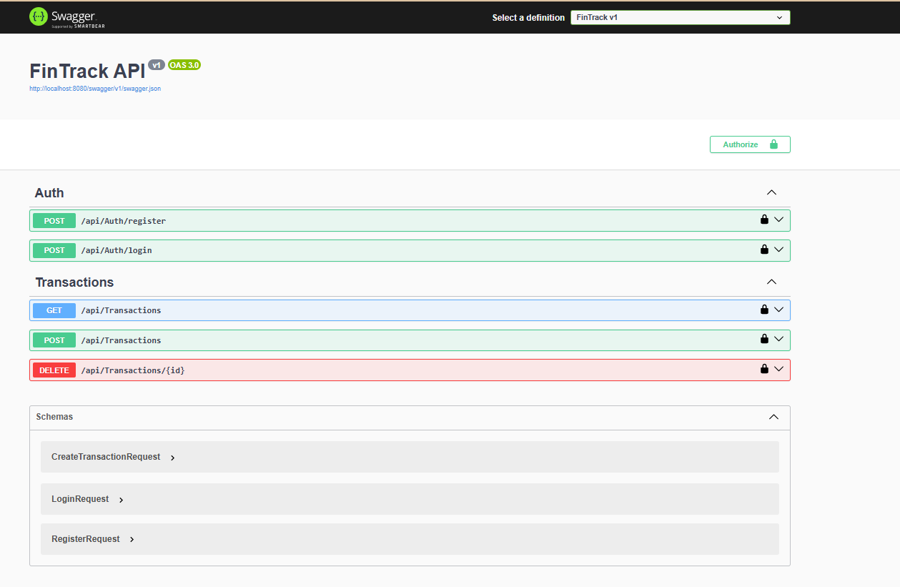

# 💸 FinTrack – Secure Finance Tracker API (.NET + SQL Server)

**FinTrack** is a secure and modular backend API system for managing personal finances. It supports **JWT-based user authentication**, **CRUD operations** for transactions and budgets, and is built with **.NET Core**, **Entity Framework**, and **SQL Server**.

This is a self-initiated personal project aimed at mastering backend development, API security, and database integration using Microsoft technologies.

---

## 🚀 Features

- 🔐 User Registration & Login (JWT Authentication)
- 📊 CRUD operations for Income & Expenses
- 🧮 Budget category management
- 🗄️ SQL Server integration using Entity Framework Core
- 📘 Swagger UI for complete API documentation
- 🔐 Secure password hashing
- 🔁 Role-based access & session management (future-ready)
- 🌐 RESTful API design with proper route structure

---

## ⚙️ Technologies Used

- [.NET 8](https://dotnet.microsoft.com/)
- [Entity Framework Core](https://learn.microsoft.com/en-us/ef/core/)
- [SQL Server Express](https://www.microsoft.com/en-us/sql-server/sql-server-downloads)
- [JWT (JSON Web Tokens)](https://jwt.io/)
- [Swagger / Swashbuckle](https://github.com/domaindrivendev/Swashbuckle.AspNetCore)
- C#
- RESTful API Principles

---


## 📂 Project Structure
```
FinTrack/
├── Controllers    # API Controllers
├── DTOs             # Request/Response Models
├── Models           # Entity Models
├── Repositories     # Data Access Logic
├── Migrations       # EF Core Migrations
├── appsettings.json   # Configuration File
└── Program.cs         # Entry Point
```
## 📦 Installation

### Prerequisites
- [.NET SDK](https://dotnet.microsoft.com/download) (v8+)
- [SQL Server Express](https://learn.microsoft.com/en-us/sql/sql-server/)
- Visual Studio / VS Code

### 1️⃣ Clone the repository

```
git clone https://github.com/Ankita-624/FinTrack.git
cd FinTrack
```

### 2️⃣ Add your connection string
```
In appsettings.json (locally):

{
  "ConnectionStrings": {
    "DefaultConnection": "Server=localhost\\SQLEXPRESS;Database=FinTrackDb;Trusted_Connection=True;TrustServerCertificate=True;MultipleActiveResultSets=true"
  },
  "Jwt": {
    "Key": "thisisaverysecurekey1234567890",
    "Issuer": "FinTrack",
    "Audience": "FinTrackUsers"
  }
}
```

### 3️⃣ Run migrations and start server
```
dotnet restore
dotnet ef database update
dotnet run
```

## 🧪 API Testing with Swagger
```
http://localhost:<your-port>/swagger
```

### Endpoints:
🔑 Auth
```
POST /api/Auth/register

POST /api/Auth/login
```
💰 Transactions
```
GET /api/Transactions

POST /api/Transactions
```

### 🔐 Sample JWT Workflow

- Register via /api/Auth/register

- Login via /api/Auth/login → copy token

- Click Authorize in Swagger and paste:
```
Bearer your_token_here
```
Use protected routes like /api/Transactions


### 📸 Screenshots


### 👤 Author
Ankita Gouda
```
🔗 GitHub: Ankita-624
🎓 Passionate Backend Developer | .NET Enthusiast | API Builder
```
### 📣 Reach Out / Collaborate
If you're hiring or collaborating on backend/API projects — feel free to connect on LinkedIn or leave a ⭐ on the repo!

